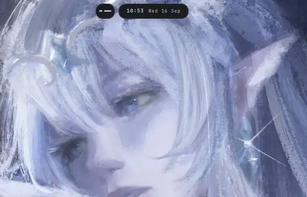
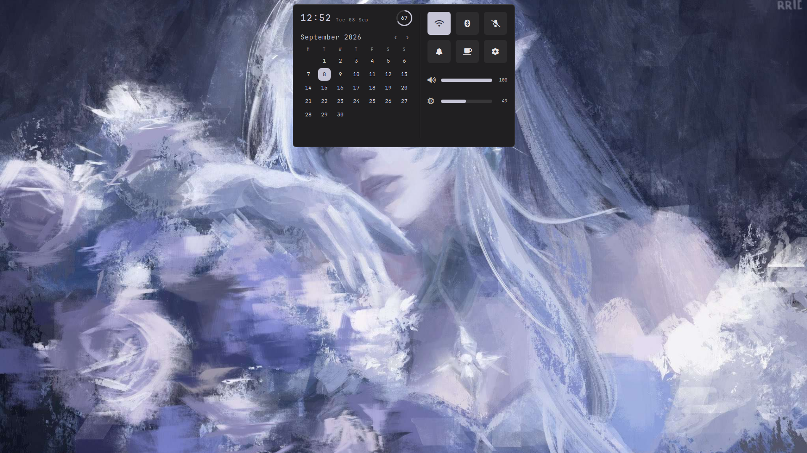
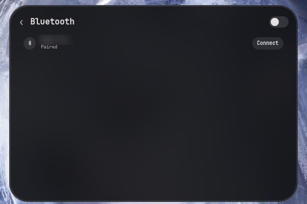
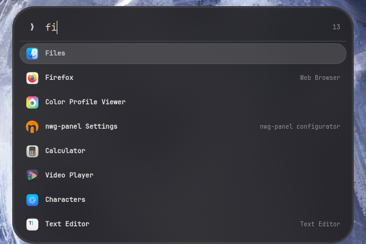
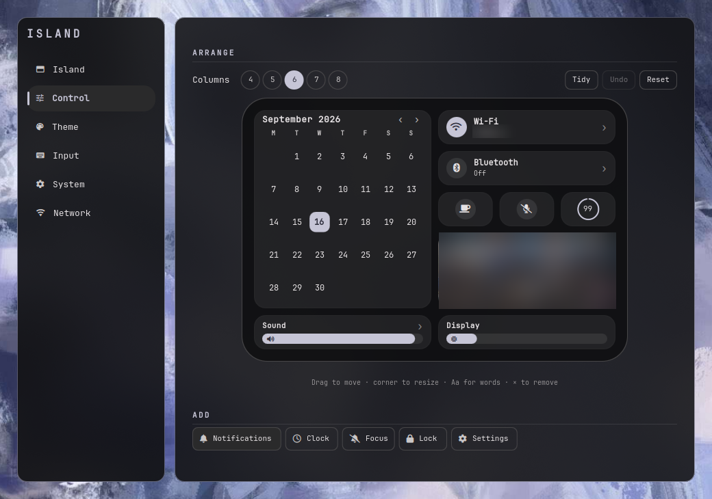

<div align="center">

# island

**one shape, everything**

A Hyprland desktop shell built around a single morphing pill and
two small pods beside it. No bar. No panels. The island *is* the
interface.

[](#contributing)
[](LICENSE)
[](https://quickshell.org)
[](https://hypr.land)
[](https://wayland.freedesktop.org)

<br>



*One surface. Clock, launcher, control centre, notifications, power —
it becomes each of them and hands the shape back. Workspaces and the
tray flank it, so a glance answers where you are and what is running.*

<sub>Captured frame by frame at 60–90fps so the springs survive, and
timestamped rather than assumed so it plays at real speed;
`docs/demo.mp4` is the same take at full quality. See
`docs/RECORDING.md`.</sub>

</div>

---

## Features

<table>
<tr>
<td width="50%" valign="top">

**One surface, eleven modes**
Clock, hover, control centre, launcher, clipboard, wallpaper picker,
power menu, notifications, notification history, volume OSD and
authorization prompts — all the same shape, morphing between them.

**Two pods, either side**
Workspaces on the left, the system tray on the right. Small capsules
that share the island's shape and motion, collapse to nothing when
they have nothing to say, and open when you point at one — or for a
moment, by themselves, when what they show changes.

**Wallpaper-driven theming**
matugen derives a palette from your wallpaper and feeds the shell,
GTK3, GTK4 *and* Hyprland's own window borders. Change the wallpaper,
the desktop follows. One wallpaper per monitor, if you want.

**A launcher in the pill**
Empty until you type, the way Spotlight is. Then fuzzy matching over
names, keywords, initials and a subsequence fallback — `fx` finds
Firefox, `ed` finds Text Editor, `dua` finds Disk Usage Analyzer,
`music` finds whatever your entries call themselves. Keyboard-first,
results scored not filtered, and the index is built once rather than
per keystroke.

**Notification daemon**
Not a client of one. The shell claims
`org.freedesktop.Notifications`: popups with working action buttons,
inline reply for chat clients that offer it, full history, Focus mode
that records without interrupting, and critical notifications that
ignore it.

**Session lock**
A real `ext-session-lock` surface with PAM authentication — not a
shell-out to hyprlock. Clock, wallpaper, battery, and a password field
that knows when to mask itself.

**Polkit agent**
Authorization prompts appear in the island rather than a mismatched
GTK dialog. polkitd still makes every decision; only the asking moved.

</td>
<td width="50%" valign="top">

**Continuous gestures**
Four-finger swipes that track your fingers rather than firing once on
release. Reads libinput directly and drives PipeWire over a persistent
socket — no process spawned per step.

**Live compositor control**
Blur, gaps, borders, rounding, pointer acceleration and key repeat,
applied to Hyprland as you move the slider. No reload, no config edit.

**Window switcher and overview**
Alt+Tab across every workspace with app icons; `Super+W` for a
workspace overview with live window thumbnails, captured through the
compositor.

**Smart visibility**
Reserve the strip so windows start below it, or let windows use the
whole screen and have the island move aside only when one actually
reaches it.

**Clipboard history**
Filterable, keyboard-driven, backed by cliphist. `Ctrl+D` deletes an
entry without leaving the field.

**System tray**
The right-hand pod, on screen rather than a scroll away. Left-click
activates, right-click opens the application's own menu, and items
asking for attention show a dot. Four icons at rest and the rest
behind a count, so a busy tray never turns the top of the screen into
a bar.

**Calendar with events**
Dates carry a dot when something is scheduled, and today's events list
under the month. Reads `.ics` files directly — GNOME Calendar's store,
vdirsyncer, khal — so nothing extra needs installing.

**Settings that show their work**
Six pages. The palette is shown as colour, the pill as a live
preview, and the control centre as itself — you drag the real cards
around. The wheel scrolls the page; **Ctrl+wheel** over a slider steps
it by one. Anything you have changed grows a revert control beside it;
sections and the whole config can be reset too.

</td>
</tr>
</table>

<div align="center">


**At rest** — the clock, the date, and a pod of workspace dashes. The
corner is a capsule at this height and opens up as the shape grows. Two
hairlines rather than one, a pixel apart: the pair has a width, so the
corner has a radius you can read.



**The control centre** — one blurred panel on a grid you arrange
yourself: calendar, Wi-Fi and Bluetooth, quick toggles, media, sliders



**A list, in the same panel** — the chevron pushes a page over the
grid rather than opening a window somewhere else



**The launcher** — the same shape, stretched. At rest it is just the
field; the list is what you typed for. Row corners are cut from the
panel's, so the list looks carved out of it rather than laid on it



**Settings → Control** — the canvas is the panel at its real size,
drawing the real cards. Drag to move, corner to resize, `Aa` for
words, `×` to remove.

</div>

---

## Why

Most Wayland setups are a bar, plus a launcher, plus a notification
daemon, plus a lock screen, plus a wallpaper tool. Five programs that
don't know about each other, don't match each other, and each need
configuring separately.

island is one surface that becomes whatever it needs to be. At rest
it's a small pill showing the time and the date, with a pod of
workspace dashes to its left and the tray to its right. Start a track
and three animated bars appear beside the date. Click the pill and it
grows into a control centre. Press `Super+R` and it stretches into a
launcher. A notification arrives and it *becomes* the notification,
then hands the shape back — and the pods fold into its edges while it
does, because only one thing should be asking for your attention at a
time.

Because it's one program, the palette is shared, the animation is
shared, and there is one settings app rather than five config files.

---

## The island

| Mode | Trigger | Shows |
|:--|:--|:--|
| `idle` | — | time and date, or the track that is playing |
| `compact` | hover | lifts all three shapes; the pill gains transport |
| `expanded` | click | calendar, battery, toggles, sliders, media |
| `search` | `Super+R` | application launcher |
| `clipboard` | `Super+V` | clipboard history |
| `picker` | `Super+Shift+W/T/I` | wallpapers, palettes, icon themes |
| `session` | `Super+Shift+Q` | lock, log out, suspend, reboot, shut down |
| `centre` | `Super+N` | notification history |
| `notify` | on arrival | a notification, briefly |
| `osd` | media keys | volume, brightness, mic |
| `auth` | on request | polkit authorization |

The pill's collapsed width is derived from its content plus a padding
constant, so nothing ever runs into the edges regardless of what's in
it. It is also what morphs: a track starting grows an equaliser out of
nothing and the shape follows. The title is deliberately not there —
it is as long as whoever named the track decided and it changes while
you are not looking, so the shape at rest would be a different shape
every few minutes. `island.pillTitle` puts it back.

Scrolling the collapsed pill moves one workspace either way. It can be
set to volume, or to nothing, in Settings → Island.

### The pods

Two capsules flank the pill. They never move the island's centre —
they hang off its edges and grow outwards.

| Pod | At rest | Open |
|:--|:--|:--|
| workspaces | dashes: long for where you are, short for occupied, a stub for empty | numbered chips, clickable |
| tray | the first four icons, quiet | every icon, at full size |

A pod opens while you point at it, for a moment after what it shows
changes, and until you click it again if you click it — clicking the
capsule itself pins it open, and the outline says so. Both collapse to
nothing when they have nothing to show: an empty tray leaves no
capsule behind, and either can be switched off entirely.

Every other mode undocks them. The control centre, the launcher and a
notification each own the whole shape, and satellites orbiting a
search field are debris.

### The control centre

The panel is a grid, and what is on it is configuration rather than
code. Each control holds a rectangle in cells:

```
calendar:0,0,3,5;wifi:3,0,3,1;bluetooth:3,1,3,1;media:3,2,3,2
         │ │ │ │
         x y w h
```

A fifth field turns a control's words off — `wifi:3,0,3,1,0` is the
badge and nothing else, at any size. It is optional, so a layout
written without it means what it always did.

Settings → Control draws that grid at full size with the real cards
in it — the Wi-Fi card says which network, the month says which month
— and you drag them around. Corner to resize, `Aa` for words, `×` to
remove, and a palette underneath for everything not currently placed.
The column count is 4 to 8; **Tidy** repacks; **Undo** goes back. The
panel's height is whatever the layout reaches, so there is no height
to set and none to disagree with what is in it.

Controls change shape rather than scaling. A Wi-Fi card three cells
wide carries the network name and a chevron into the list; squeezed to
one — or with its words turned off — it is the badge alone and keeps
only the power toggle. A slider
wide enough for a label has one, and taller than it is wide it stands
up and fills from the bottom.

Wi-Fi, Bluetooth and Sound have lists behind their chevrons, drawn
over the grid inside the same panel — the shape does not change, the
grid steps aside, the list slides in, and the chevron comes back.
Clicking Wi-Fi used to open the Settings window on the Network page,
which is a strange answer to "what networks are around".

Album art in a media card is washed with the accent colour, so a card
belongs to the theme whatever the record label chose. That detail, the
lists-in-the-panel and the layout editor are all taken from
[saneAspect's Dynamite V3](https://www.youtube.com/watch?v=Ob98KFByTec).

### Motion

The shape springs open and settles shut. Those are different curves,
because they are different events: a spring on arrival feels
responsive, and a spring on dismissal feels like the interface arguing
with you.

| | Curve | Time |
|:--|:--|:--|
| open | spring, damping 0.78 — about 1.5% overshoot | 240 ms |
| close | critically damped, no overshoot | 200 ms |
| hover | spring, damping 0.78 | 200 ms |
| pod peek | spring, damping 0.55 | 300 ms |
| content in | 40 ms lead, then 150 ms | 190 ms |
| content out | immediately, and quicker | 90 ms |

Those are the **fluid** tempo, and the numbers are measured rather
than invented. Sampling [saneAspect's Dynamite
V3](https://www.youtube.com/watch?v=Ob98KFByTec) at 60fps — the
panel's height in one column of pixels, frame by frame — its control
centre opens in about 180 ms and overshoots its final height by 1.4%,
which is a damping fraction of roughly 0.8. That was already this
spring. The only thing that differed was the clock: 460 ms against his
180. Two and a half times slower is the whole of the difference
between motion you feel and motion you wait for.

**calm** is the old tempo, kept for anyone who wants the extra beat on
a large screen. **springy** keeps the speed and spends the damping
instead: 0.62 is an overshoot you watch rather than feel.

The content is choreographed against the shape rather than gated on
it. It used to wait until the pill had reached 97% of its final width
and only then fade in, which is why opening the control centre read as
a resize followed by a screen. Now the shape moves alone for 80ms, the
content fades into it while it is still growing, and it is fully in
long before the shape settles. On the way out the content leaves
first: content still fading while the shape closes over it looks like
a mistake.

`Services/Motion.qml` holds the whole vocabulary — it samples a damped
second-order step response and hands Qt a bezier spline, since Qt has
no spring easing. Tempo is one control in Settings → Island; damping,
durations and the content lead are each their own slider a fold below
it, and **Reduce motion** drops the springs and the shape morphs while
keeping the cross-fades.

### Shape

One radius is set; everything else derives from it. `Theme.radiusSmall`,
`radiusNormal` and `radiusLarge` are 0.6x, 1x and 1.2x of the panel
radius, so the slider in Settings → Theme moves every corner in the
shell together rather than the two that happened to reference it.

Which of the three a shape gets is a question about what kind of thing
it is, not about how big it is — size is already in the answer, because
Qt clamps a radius to half the shorter side, so at a large setting a
28px button becomes a capsule while the panel behind it stays a rounded
rectangle:

| Token | What it is for |
|:--|:--|
| `radiusLarge` | a **card** — something that holds other things and sits on a surface: control-centre cards, a selected row in a list, overview and picker cards, an icon tile, a popup |
| `radiusNormal` | a **panel**, or a field you type into: the settings window and its sidebar, a segmented control, a password box |
| `radiusSmall` | a **chip** — a small control holding one word or one glyph: buttons, tabs, a thumbnail inside a card |

There is a fourth case and it is deliberately not a token: a shape whose
roundness is a fact about the shape rather than a preference. A toggle
knob, a slider handle, a workspace dash, the cap on a 3px tick — those
are `height / 2`, written where they are drawn. `radius: 1.5` beside
`width: 3` is the same number with the reason taken out of it, and it
stops being a capsule the moment somebody changes the 3.

The island's own corner is a function of its height, not a constant:

```
Theme.corner(h) = min(h / 2, island.radius + h * 0.06)
```

A single number cannot serve both ends of a shape that morphs from a
34px pill to a 374px panel — at 14 the pill is three pixels short of a
capsule, and the panel gets that same 14 on something ten times taller.
The height is already spring-animated, so **the corner opens up as the
shape does**, for free.

---

## Install

```bash
git clone https://github.com/Sid-5137/island-dots
cd island-dots && ./install.sh
```

Clone it wherever you like — nothing assumes `~/island-dots`.

The script symlinks `hypr/` and `quickshell/island/` into `~/.config`
and `bin/` into `~/.local/bin`, creates the state directories,
generates `~/.config/island/matugen.toml` with this machine's absolute
paths, puts `~/.config/gtk-{3,4}.0/gtk.css` under the shell's control,
and reports missing dependencies — including the icon font, which it
checks by glyph rather than by name. It installs nothing for you; the
one exception it offers is `/etc/pam.d/island`, which is also the only
thing it does that needs root — say no and the lock screen still works,
just without a fingerprint reader. Re-run it any time; it is
idempotent.

**Requires**

```
hyprland quickshell matugen adw-gtk3-theme qt6ct
wl-clipboard cliphist brightnessctl playerctl hyprshot slurp
hypridle NetworkManager bluez python3
```

Fonts: **JetBrainsMono Nerd Font, v3 or newer**. Every glyph the shell
draws comes from it — `Services/Icons.qml` is the list — and v3 matters:
it moved the whole Material Design range from `U+F500..U+FD46` up to
`U+F0000` and beyond, and the shell uses the new codepoints. A v2 patch
has the same family name and satisfies any check for it, then draws
nothing where the Wi-Fi bars, the settings tab icons and the padlock on
a secured network go. `install.sh` checks for a glyph rather than for a
name for exactly that reason, and reports a v2 patch as something to
replace rather than something to add to. To check by hand:

```bash
fc-list ':charset=f0928' family   # md-wifi_strength_4; v3 only
```

Icons: an XDG icon theme for application icons in the launcher, the
tray and notifications — `adwaita-icon-theme` and `hicolor-icon-theme`.
Cursors ship configured as `Bibata-Modern-Ice`; any installed theme
works, and Settings > Theme lists what you have.

Optional: `qt6-qtimageformats` for WebP, AVIF and JPEG XL wallpapers.
Without it those files are left out of the picker rather than offered
as tiles that cannot be drawn. `fprintd` for fingerprint unlock.

Four-finger gestures need input device access:

```bash
sudo usermod -aG input "$USER"
```

**One thing that will bite you**

The shell is the notification daemon and the polkit agent. mako, dunst
and any external polkit agent must not be running alongside it.

GTK used to be the other one: the theme had to be `adw-gtk3` and not
`adw-gtk3-dark`, because the dark variant loaded a stylesheet that
ignored the matugen overrides. That is no longer true — the shell
imports whichever theme you pick and applies the palette on top of it,
so either works. Pick one in the settings app and nothing else needs
setting by hand.

---

## Configuration

Everything is in the settings app — `Super+S`.

The checkout is code and belongs in git.
`~/.config/island/settings.json` is this machine's state and doesn't.
It's written on first run from the defaults in `Services/Config.qml`,
and merged against them on every start — so an update that adds a
setting picks it up without the file being deleted.

`settings.example.json` shows every key and its shipped default. It is
generated from `Services/Config.qml` by `bin/island-gen-example` and is
documentation only; the shell never reads it. `--check` says whether it
is current, which is worth running after adding a setting.

One consequence of the merge worth knowing: it preserves values you
already have. If a release changes a *default*, your existing file
keeps the old value. Delete `settings.json` to take the new defaults.

```
bin/                  linked into ~/.local/bin by install.sh
                      island-gestures     libinput gesture daemon
                      island-gtk-apply    GTK/Qt appearance
                      island-calendar     .ics reader
                      island-gen-example  regenerates the example config
hypr/                 Hyprland config, one module per concern
pam/                  PAM template for the lock screen
matugen/              Wallpaper → palette templates
quickshell/island/
  Services/           Singletons. No UI.
  Widgets/            Reusable controls. No state.
  Background/         Wallpaper layer
  Island/             The pill, its geometry and mode resolution
  Island/Modes/       One file per mode
  Island/Pods/        The capsules beside the pill
  Lock/               Session lock surface
  Settings/           Settings window and its pages
```

---

## Theming

Wallpaper → matugen → four outputs:

| Output | Read by |
|:--|:--|
| `~/.local/state/island/colors.json` | the shell, via `Services/Theme.qml` |
| `gtk-3.0/matugen.css` | GTK3, through adw-gtk3 |
| `gtk-4.0/matugen.css` | GTK4 / libadwaita, directly |
| `hyprctl eval` | window borders, via `Services/Compositor.qml` |

GTK3 and GTK4 need separate templates — GTK3 reads the `theme_*`
family, GTK4 reads only the `adw` names.

matugen writes `matugen.css`, never `gtk.css`. `gtk.css` is contested:
adw-gtk3's own GTK4 install step symlinks it to a root-owned file
under `/usr/share/themes`, and matugen aborts its *entire* run on the
first output it cannot write — so one stray symlink silently took down
the palette and the GTK3 colours with it. `bin/island-gtk-apply` owns
`gtk.css` and imports the theme and `matugen.css` into it:

```css
@import url("file:///usr/share/themes/<your theme>/gtk-4.0/gtk.css");
@import url("matugen.css");
@import url("user.css");   /* only if you create it */
```

Put your own CSS in `user.css` next to it. `gtk.css` is regenerated.

Firefox, Chrome and Electron apps do their own theming and won't
follow. That isn't a bug in the setup.

---

## Scope

island is a shell, not a desktop environment. It provides the layer
above your compositor and stays there.

**In scope:** the pill and its modes, notifications, launcher,
clipboard, lock, idle, OSD, theming, wallpapers, settings.

**Not in scope:** window management and tiling (Hyprland's job),
drive mounting (udisks), screen casting (the compositor), a file
manager, a terminal.

---

## Notes for anyone reading the source

Things that cost real time to work out:

- **A bezier spline easing can take the whole process down.** Qt does
  not validate `easing.bezierCurve`, and it does not warn: a malformed
  spline segfaults the shell the first time something animates, with a
  stack trace pointing at whatever socket happened to be dispatching.
  Two separate shapes do it, and a sampled spring curve hits both by
  accident:
  - segments of different widths in x — twelve narrow ones and one
    wide one is enough;
  - segment endpoints that step back down in y, which is exactly what
    an overshoot looks like if you sample it naively.

  Control points are unconstrained, so the fix is to keep the segments
  uniform, clamp the endpoints to a non-decreasing sequence, and let
  the control points carry the overshoot. `Services/Motion.qml` does
  that, and the comment there says so.

- **Hyprland's Lua migration breaks things silently.** Three separate
  APIs stopped working with no error and no log line:
  - `hyprctl keyword` — rejected outright with "keyword can't work
    with non-legacy parsers". Use `hyprctl eval` with an
    `hl.config({...})` block.
  - `hyprctl dispatch workspace 2` — wrapped as
    `hl.dispatch(workspace 2)`, which is not valid Lua. Dispatchers
    take Lua now: `hl.dsp.focus({ workspace = 2 })`.
  - Argument names changed with it. Focusing a window is
    `hl.dsp.focus({ window = "address:0x..." })`; a top-level
    `address =` is accepted and silently ignored, which is worse than
    an error.

  After a Hyprland update, test each of these by hand before assuming
  the shell is at fault:

  ```bash
  hyprctl dispatch 'hl.dsp.focus({ workspace = 2 })'
  hyprctl eval 'hl.config({ decoration = { rounding = 12 } })'
  qs -c island ipc call wm windows      # then focus one by address
  ```

- Do not make the pill's own properties conditional per mode. Colour,
  border width and `clip` switching mid-morph were the cause of every
  flicker in the control centre. Content inside a mode can vary
  freely; the surface it sits on should not.
- A `PropertyChanges` that overrides a *bound* property replaces the
  binding rather than animating through it. The island uses plain
  bindings and no QML `States` for that reason.
- A `readonly` property nothing reads is evaluated lazily, so its
  change signal never fires.
- `clip: true` clips to the bounding rectangle, not the rounded shape.
  Anything opaque touching a rounded corner must round it itself.
- `anchors.centerIn` centres a text's line box, not its glyph. Icon
  fonts reserve descent space they never use.
- A `Grid` takes its width from its children — deriving a child size
  from the Grid's width is circular and collapses silently.
- **Notifications are destroyed the moment the handler returns**
  unless you set `tracked = true` on them. Nothing did, so
  `trackedNotifications` was always empty and the object each history
  entry held was already dead. The JavaScript wrapper stays *truthy*
  after that and every property read comes back `undefined`, so it
  fails as a `TypeError` at the call site rather than anywhere near
  the cause — which is why action buttons silently did nothing for
  the entire life of the project. History stores copies and looks the
  live object up by id.

- **`Qt.callLater` is not "after the surface is down".** It runs
  before the event loop returns to Wayland. Dispatching a focus change
  from it while a layer still holds `WlrKeyboardFocus.Exclusive` means
  the compositor restores focus over the top of you a moment later.
  This is the whole of the Alt+Tab bug. Use a short timer.

  It hid behind a coincidence: focusing a window on *another*
  workspace also switches workspace, which leaves the restore nothing
  on screen to put focus back onto. So it worked across workspaces
  and failed within one, which reads like anything except a focus
  race.

- **A `Repeater` needs a visual parent.** In a singleton it has none,
  so its delegates are never created and whatever they were supposed
  to do silently does not happen. `Instantiator` is the non-visual
  one.

- **Everything inside `Variants` exists once per screen**, including
  `IpcHandler`. Two handlers claiming one target collide and the loser
  is not registered, so on a second monitor it is load order that
  decides which of your keybinds work. `Services/Screens.qml` names
  one island the owner.

- **`qs ipc call <target> show` cannot work.** `show` is eaten by
  `qs ipc show` before it reaches the function name, and `--` does not
  help. Every `show()` here also answers to `open()`.

- **A declared property is not a drawn one.** `SliderRow` had a
  `description` for years and never rendered it, so every explanation
  written for a slider was invisible and nobody could tell from the
  source that it should not have been.

---

## Roadmap

- [ ] **Inline reply is send-only.** The field delivers the reply and
      the notification closes. Chat clients that send a follow-up in
      the same conversation start a new notification rather than
      threading, because the spec has nowhere to put a thread.

- [ ] **Per-monitor scaling.** Wallpapers are per monitor now, but the
      pill's geometry is in pixels and does not follow a screen's
      scale factor, so it is smaller on a HiDPI second display.

- [ ] **Calendar is read-only.** `bin/island-calendar` parses .ics
      files directly, so events appear without khal. Writing one back
      would mean speaking CalDAV, which is a different program.

- [ ] **Recurrence rules are partial.** `FREQ`, `INTERVAL`, `COUNT`,
      `UNTIL`, `EXDATE` and weekly `BYDAY` cover the overwhelming
      majority of real calendar entries. `BYSETPOS`, `BYMONTHDAY` and
      the rest of RFC 5545 fall back to the first occurrence rather
      than being dropped.

- [ ] **Fingerprint is untested.** The PAM file ships and the shell
      reports which piece is missing, but it has never run against an
      actual reader — there isn't one on the machine this was built
      on. If you have one, an issue either way would be useful.

- [ ] **The layout editor has not been driven by a real pointer.**
      Settings -> Control was built and checked against the model —
      collisions, packing, undo, the column count — but the drag and
      the corner resize were never exercised with an actual mouse, so
      the arithmetic that turns a pointer into a cell is the part most
      likely to be a pixel out.

- [ ] **`xray` on the island layer is unverified.** Hyprland's Lua
      layer-rule parser ignores keys it does not recognise without
      logging anything — a deliberately bogus field produced no output
      at all — so the rule in `hypr/rules.lua` is taken on the
      documentation's word. If the island's blur still changes with
      whatever window is behind it, that line is doing nothing.

- [ ] **Continuous gestures need a daemon.** `bin/island-gestures`
      reads libinput directly because Hyprland's `gesture` action
      fires once on release. This is a note rather than a task: it
      needs a progress callback for custom gestures upstream, and
      until that exists there is nothing to do here.

## Contributing

Beta, and tested on one machine. If you try it and something breaks,
[open an issue](https://github.com/Sid-5137/island-dots/issues/new) —
that's more useful than a star.

`docs/RECORDING.md` covers how the demo was captured — no recorder
package needed — if you want to show a variation.

---

<div align="center">

Built on [Quickshell](https://quickshell.org) (LGPL-3.0).
GTK/libadwaita theming follows the method documented by
[Noctalia](https://docs.noctalia.dev).

**GPL-3.0** · Copyright © 2026 Siddhartha Mallavolu

</div>
